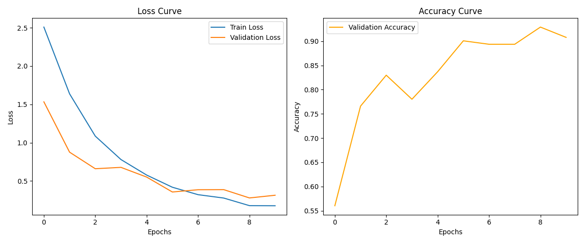

Here is a comprehensive, professional `README.md` for your project. I have structured it to highlight the technical details (like the grayscale adaptation) which matches your background as an Algorithm Engineer.

---

# 3D CNN Video Classification (Grayscale Adaptation)

This project implements a Deep Learning pipeline for Video Action Recognition using **3D Convolutional Neural Networks (3D CNNs)** in PyTorch. It is designed to train state-of-the-art models (R2Plus1D-18 and MC3-18) on custom datasets.

A key feature of this implementation is the **automatic adaptation of pre-trained RGB models to handle 1-channel Grayscale video input** without losing pre-trained spatial weights.

## 📌 Features

- **Models:** Supports `r2plus1d_18` and `mc3_18` (Torchvision).
- **Grayscale Adaptation:** Dynamically modifies the first convolutional layer (`stem`) to accept 1-channel input by summing pre-trained RGB weights (`R+G+B`).
- **Temporal Sampling:** Handles variable-length videos by standardizing to a specific FPS and max duration.
- **Training Pipeline:** Includes training/validation loops, checkpointing (Best Validation Accuracy), and automatic learning curve plotting.
- **Multi-GPU Support:** Logic included for `DataParallel` (configurable).

## 🛠️ Installation

1.  **Clone the repository:**

    ```bash
    git clone https://github.com/your-username/video-classification.git
    cd video-classification
    ```

2.  **Install dependencies:**

    ```bash
    pip install torch torchvision matplotlib tqdm
    ```

## ⚙️ Configuration

You can adjust the hyperparameters in the `--- CONFIGURATION ---` section of `train.py`:

| Parameter      | Default         | Description                                     |
| :------------- | :-------------- | :---------------------------------------------- |
| `model_name`   | `'r2plus1d_18'` | Model architecture (`r2plus1d_18` or `mc3_18`). |
| `batch_size`   | `3`             | Batch size (Adjust based on VRAM).              |
| `target_fps`   | `5`             | Frames Per Second to resample videos to.        |
| `max_duration` | `8`             | Maximum video duration in seconds.              |
| `num_epochs`   | `10`            | Number of training epochs.                      |

## 🚀 Usage

Run the training script:

```bash
python train.py
```

### Outputs

Upon completion, the script generates:

1.  **`{model_name}_best_model.pt`**: The model weights with the highest validation accuracy.
2.  **`training_curves.png`**: A visualization of Loss and Accuracy over epochs.

## 🧠 Technical Details

### Grayscale Weight Initialization

Standard ImageNet/Kinetics models expect 3-channel RGB inputs. Since this use case involves grayscale video (e.g., IR, depth, or surveillance), the input layer is modified programmatically:

$$W_{new} = \sum_{c \in \{R,G,B\}} W_{old}^{(c)}$$

The code replaces the first `Conv3d` layer:

```python
# Create new 1-channel layer
new_layer = nn.Conv3d(in_channels=1, ...)

# Initialize by summing weights across the channel dimension
with torch.no_grad():
    new_layer.weight[:] = old_layer.weight.sum(dim=1, keepdim=True)
```

This preserves the structural patterns learned during pre-training, acting as a better initialization than random noise.

## 📊 Results Visualization

The script automatically plots metrics at the end of training:



Figure: Training and validation loss and accuracy over epochs (file: `training_curves.png`).

## 📜 License

[MIT](https://choosealicense.com/licenses/mit/)

---

### **Next Step**

Would you like me to help you create the **`dataset.py`** file (including the `VideoDataset` class and `video_collate_fn`) referenced in the imports, or do you already have that file ready?
